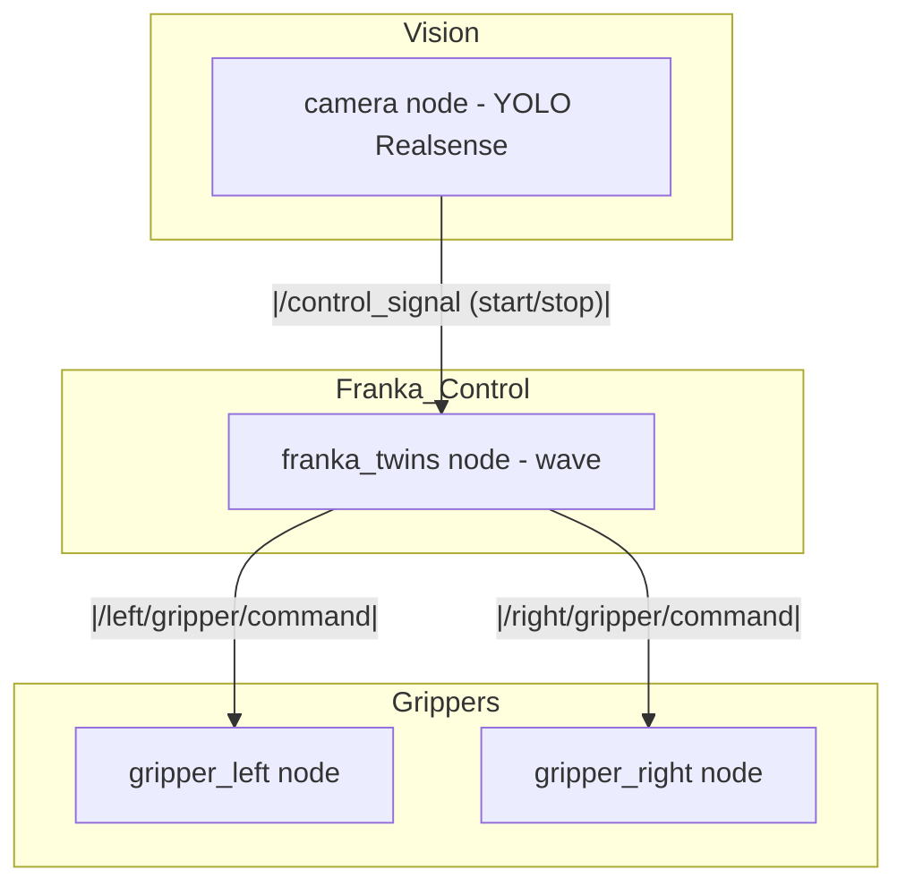
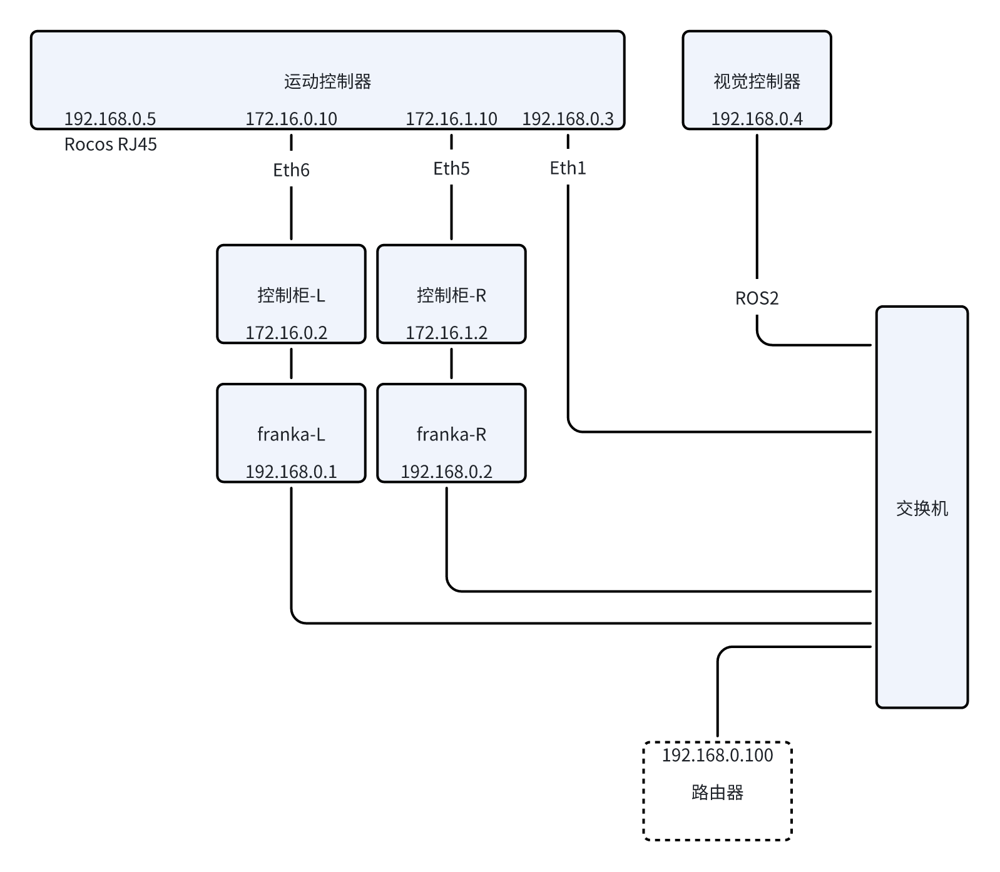
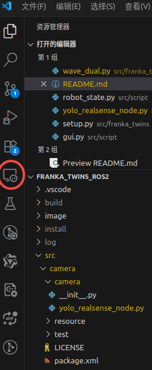
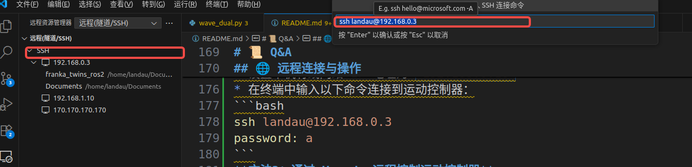
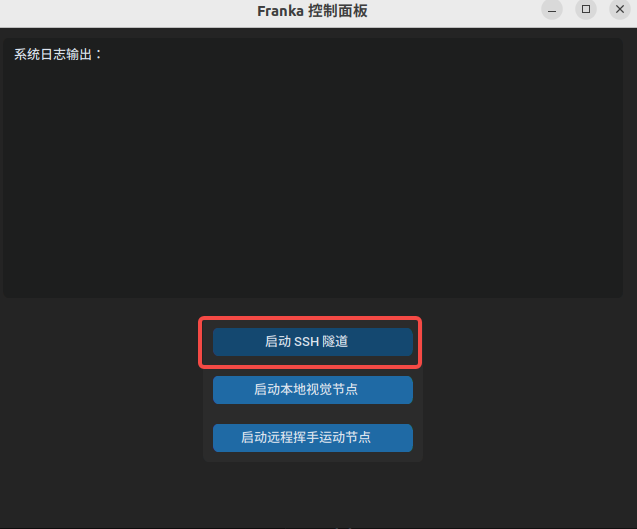
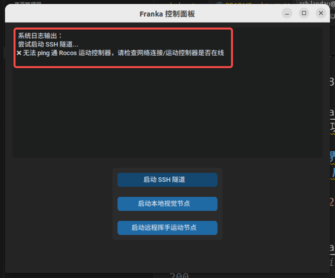

# Franka Symphony: ROS 2 Dual-Arm Manipulation Framework

> A ROS 2-based control and coordination framework for dual Franka arms.


## ✨ Overview

**Franka Symphony** builds upon several excellent open-source projects to provide a dual-arm manipulation framework.  
This repository **integrates and extends** the capabilities of [franky](https://github.com/TimSchneider42/franky) to support coordinated control of two Franka Panda robots under ROS 2.

---

## 🤝 Acknowledgments

This project was inspired by and partially based on:

- [franky](https://github.com/TimSchneider42/franky): A high-level C++ and Python interface for real-time Cartesian impedance control of Franka arms.  
  We use franky as the core low-level control backend for motion primitives.
- [libfranka](https://github.com/frankaemika/libfranka): Official C++ interface to the Franka Control Interface.
- The ROS 2 communities.

Special thanks to Tim Schneider for developing franky and making it available under the MIT License.

---

## 📂 Repository Structure

```plaintext
franka_twins_ros2/
├── src/
│   ├── camera/                # Camera node for object detection
│   ├── franka_twins/          # Main package for dual-arm control  
│   ├── gripper/               # Gripper control package
│   ├── script/                # example scripts for the framework
│   └── tosor_msgs/            # Custom message definitions
├── README.md                  # Project documentation

```
📈 系统话题关系图

---

## ⚙️ Requirements

- Ubuntu 22.04
- ROS 2 Humble 
- libfranka == 0.15.0
- Franka Control Interface (FCI)
- Franky
- YOLOv8 (for object detection)

---

# 🚀 Quick Start

1️⃣ **Clone this repository**
```bash
git clone https://github.com/rocos-sia/franka_twins_ros2.git
cd franka_twins_ros2
```


2️⃣ **Relative dependencies**
```bash
pip install franky-control
pip install pyrealsense2
pip install mediapipe
pip install --upgrade pip
pip install "protobuf>=5.26.1,<6.0dev"
pip install "grpcio>=1.64.0"
pip install ultralytics
rosdep install -i --from-path src --rosdistro humble -y
```


---

3️⃣ **Build the Package**

在工作空间根目录下执行：

```bash
colcon build --symlink-install
source install/setup.bash
```

---

## 🚀 代码示例运行

### 🤖 1. 启动机器人运动控制


先运行运动节点，它会自动开始循环执行 `move()`：

```bash
ros2 run franka_twins wave
```

在运行中，可以通过话题发布控制指令：

✅ **停止运动**

```bash
ros2 topic pub /control_signal std_msgs/String "data: 'stop'"
```

✅ **重新开始运动**

```bash
ros2 topic pub /control_signal std_msgs/String "data: 'start'"
```

---

### 🦾 2. 夹爪控制

#### ✋ 单夹爪模式

分别启动左/右夹爪：

```bash
ros2 launch gripper gripper_right.launch.py
ros2 launch gripper gripper_left.launch.py
```

通过话题发送夹爪开合命令：

```bash
ros2 topic pub /right/gripper/command tosor_msgs/msg/GripperDistance "{distance: 100}"
```

#### 🫱🫲 双夹爪模式

启动双夹爪：

```bash
ros2 launch gripper gripper_dual.launch.py
```

分别控制左右夹爪：

```bash
ros2 topic pub /left/gripper/command tosor_msgs/msg/GripperDistance "{distance: 100}"
ros2 topic pub /right/gripper/command tosor_msgs/msg/GripperDistance "{distance: 100}"
```

---

### 📷 3. 相机与检测

运行YOLO检测节点（Realsense相机）：

```bash
ros2 run camera yolo_realsense_node
```

---

## 📝 提示

* 上述机械臂相关的运动指令必须在启动机械臂FCI功能同时机械臂上使能后执行。
* 所有命令均需在工作空间构建并 `source install/setup.bash` 后运行。
* 如需同时启动多个节点，建议使用多终端或将其写入 `launch` 文件。
* 相机节点会自动连接到指定的Realsense设备（如338622070052），可根据实际设备修改配置。检测人与机械臂的距离<1.5m时，发送/control_signal std_msgs/String "data: 'stop'"。检测到人与机械臂的距离>1.5m时，发送/control_signal std_msgs/String "data: 'start'"。
* 夹爪控制命令中的 `distance` 取值范围为0-1000，表示夹爪开合程度。

---
# 📜 Q&A
## 🌐 远程连接与操作
**方法1：通过 SSH终端 远程控制运动控制器**


可以通过 SSH 远程连接到运动控制器。确保网线插入到控制柜的交换机网口，并使用以下命令进行连接：
* 设置本机有线网络 IP 地址为 `192.168.0.10`
* 在终端中输入以下命令连接到运动控制器：
```bash
ssh landau@192.168.0.3
password: a
```
**方法2：通过 Vscode 远程控制运动控制器**
* 在 Vscode 中安装 Remote - SSH 插件
* 在 Vscode 的左侧栏中点击 Remote Explorer 图标

* 点击 "+" 按钮，输入以下信息：
  ```bash
  ssh landau@192.168.0.3
  ```

* 输入密码 `a`，连接成功后可以在 Vscode 中远程编辑和运行运动控制器的代码。
  
## 🖥️启动Franka的Web界面（Web Interface）
***Franka的控制器（通常是一个工控机或外部PC）自带一个Web界面:***
* Robot启动/停止
* 手动模式切换
* 夹爪配置
* 网络设置
**方法1：通过GUI页面程序启动Web界面**
```bash
cd franka_twins_ros2/
python3 gui.py
```




**方法2：通过浏览器启动Web界面**
****请给运动控制器外接显示器，打开浏览器，输入以下地址访问Web界面：****
```plaintext
左臂
http://172.16.0.2
```
```plaintext
右臂
http://172.16.1.2
```


## 📄 License

This project is licensed under the Apache License 2.0.  
Note that components derived from franky remain subject to the MIT License.
